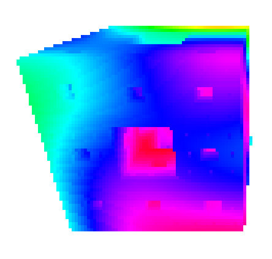
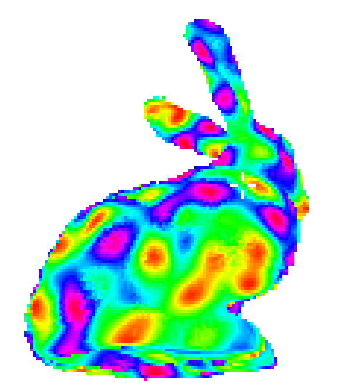
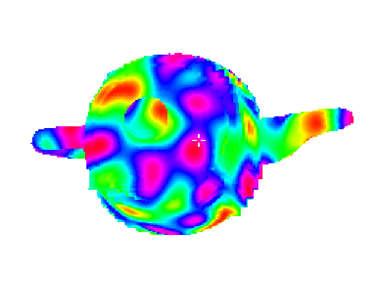
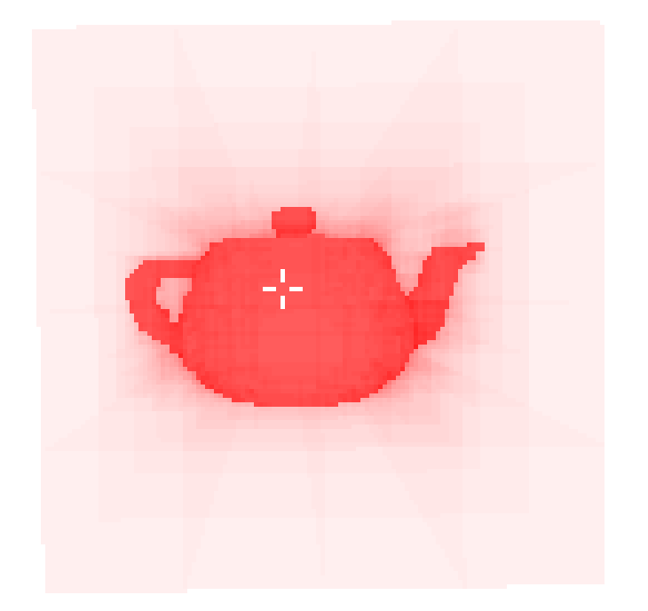

# CPU 3D renderer

This repository implements a renderer for 3D models using CPU capabilities. The implementation uses the Ray-Casting method and the SDL2 library. The main objective of this project is to provide a simple and non-trivial platform to test compact representation of 3D models

## Dependencies
The implementation has two main dependencies
- [SDSL - Succinct Data Structure Library](https://github.com/simongog/sdsl-lite)  
- [SDL2 library](https://www.libsdl.org/) 

## Representation for 3D models
The project support the following representations
- *3D array representation*: The classical 3D matrix implementation
- *Octree*: A pointer-based implementation of the octree data structure
- *k<sup>3</sup>-tree*: A compact version of the octree using succinct data structures (*k3-lidar-lite* folder). The implementation was obtained from the [k<sup>3</sup>-lidar repository](https://gitlab.lbd.org.es/fsilva/k3-lidar) of Fernando Silva.

## How to use

### Compilation
Change the path to SDSL folder in the Makefile and then execute

 ```
make
 ```

### Execution

 ```
./render <list of flags>
 ```
flags: 

* `-s <n>`, where *n* is the model resolution (64 by default)
* `-r <n>`, where *n* is the screen resolution (0.2 by default)
* `-d <n>`, where *n* is the id of the underlying representation (3 by default). Valid values are
   - 0: 3D array
   - 1: Pointer-based octree
   - 2: Pointer-based octree with stack
   - 3: k<sup>3</sup>-tree
* `-m <n>`, where *n* is the type of model (2 by default). Valid values are
   - 0: Noisy model
   - 1: Noisy-solid model
   - 2: Mesh
   - 3: Random model
* `-render <n>`, where *n* is the type of visualization (0 by default). Valid values are
   - 0: Display the model using colors (colors generated in the SimplexNoise.cpp implementation)
   - 1: Display the model using colors and a shadow effect
   - 2: Display the model using gray-scale
   - 3: Display the model making explicit the space sub-divisions of the octree-based representations
   - 4: Display the model making explicit the space sub-divisions of the octree-based representations, but omiting empty regions
* `-mf <filename>`, where *filename* is a STL file with the 3D model. This flag has to be used in combination with `-m 2`. Examples of STL files can be found in the *models* folder. 
* `-p <n>`, where *n* is the number of random points to be inserted. This flag has to be used in combination with `-m 3`
* `-rx <n>`, where *n* is the degree rotation at X axis
* `-ry <n>`, where *n* is the degree rotation at Y axis
* `-rz <n>`, where *n* is the degree rotation at Z axis

### Examples

|  |   |
|:--:|:--:|
| ```./render -mf cube```| ```./render -mf bunny -s 512```|
|  |   |
| ```./render -s 1024```| ```./render -mf teapot -render 3```|


## Contributors
- Nicolás Rojas ([link](https://github.com/zetaso)). The original version of this repository corresponds to his undergrad thesis (see the thesis document [here (Spanish)](http://www.inf.udec.cl/~jfuentess/files/theses/ugrad_thesis_NR.pdf)
- José Fuentes ([link](https://github.com/jfuentess))
